Всем привет!
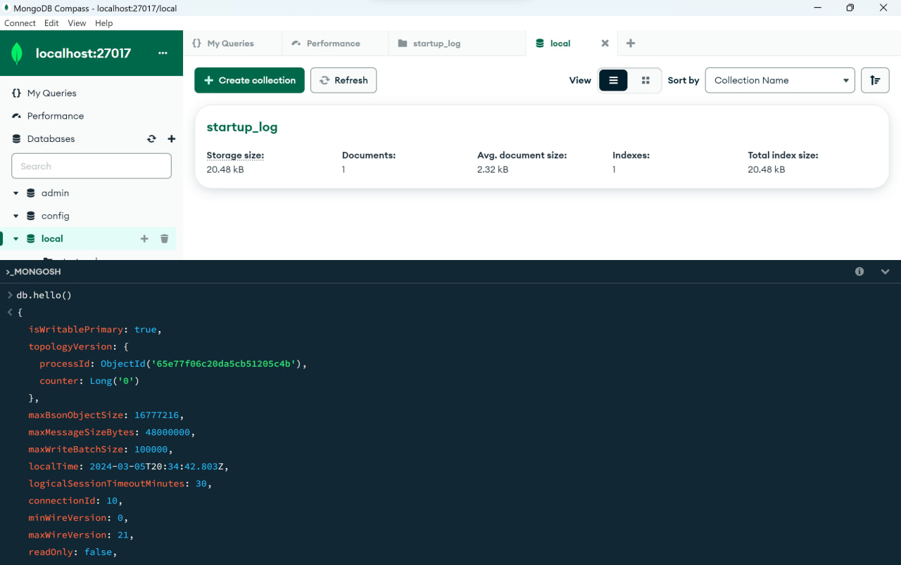
Захотелось поиграть с датасетом с myanimelist.com. Он старенький, а впрочем как раз будет актуально поделать все CRUD запросы.

Сперва захотелось поискать аниме, где только одна серия есть
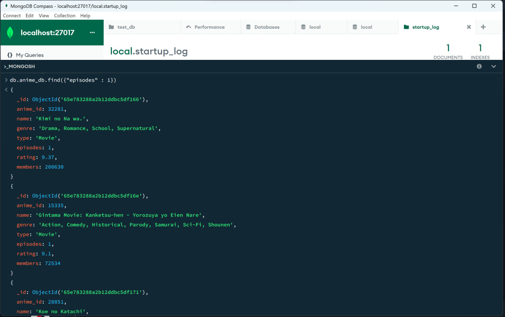

Дальше попробуем добавить еще одно аниме в датасет, как раз там нет одной части одного известного тайтла
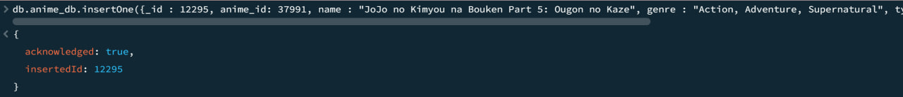
Проверим, что все окей
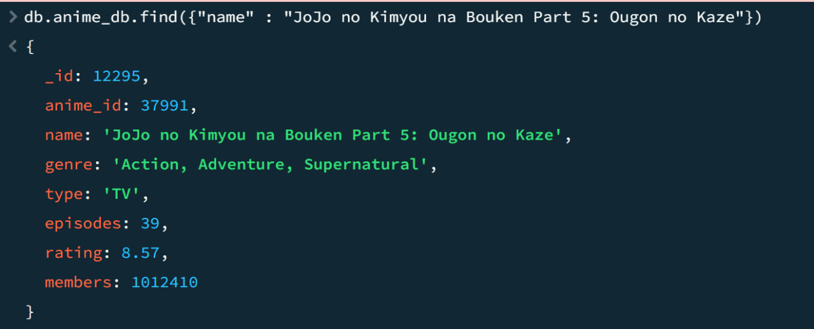
Кайф

Слишком ужасное аниме, стоит удалить
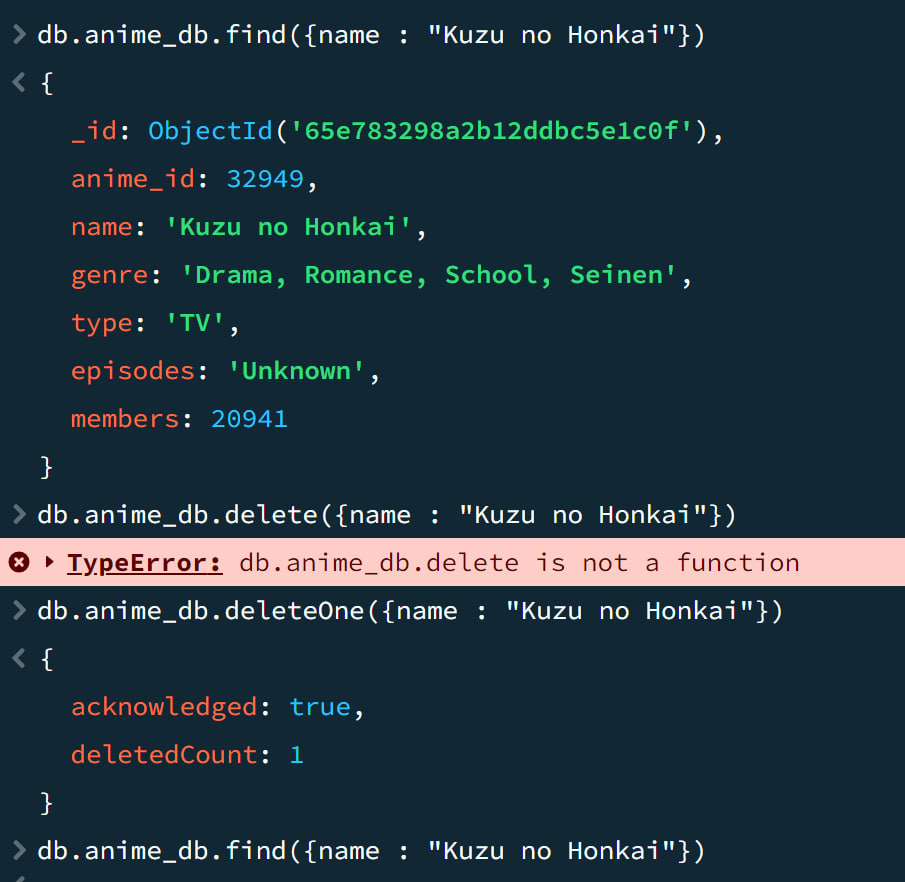
Пока непривык к синтаксису, а впрочем, данным промежуточным результатом я очень доволен.

Чото на первом месте неакутальное аниме, нужно обновить рейтинг актуальный, и количество посмотревших людей
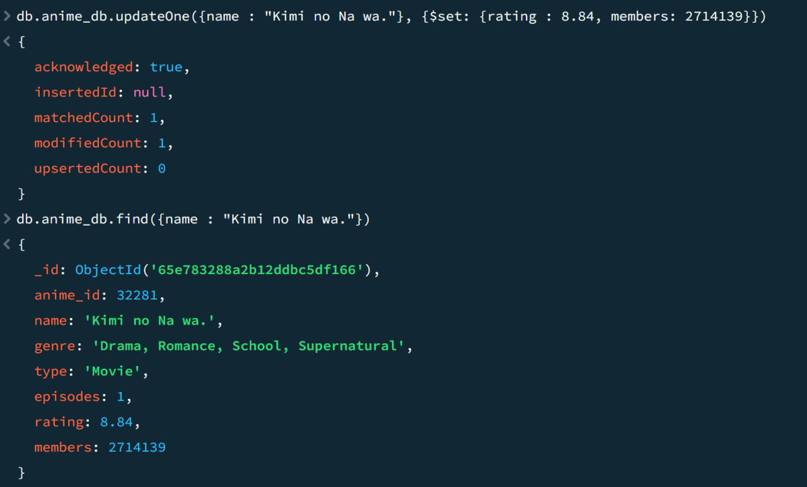
Успокоили фанатов алхимика

Сделаем read запрос немного по-труднее. Посмотрим на топ рейтинга с ограничением на количество просмотров
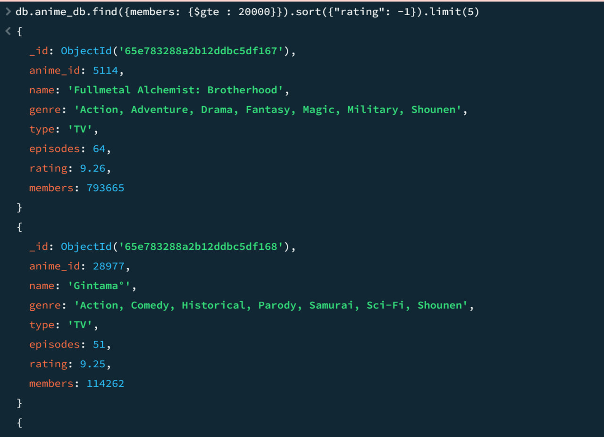

Теперь посмотрим на статистику нашего запроса
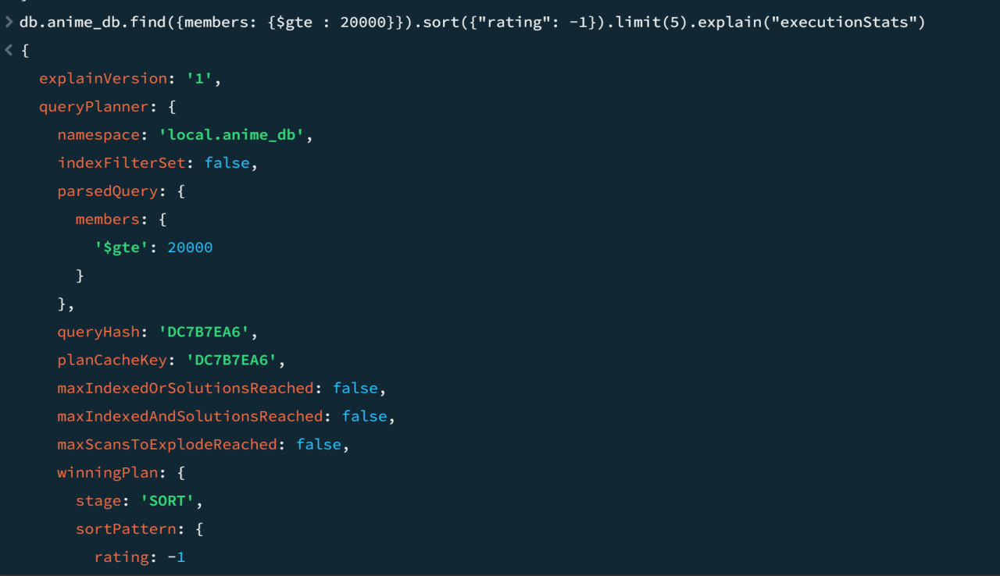
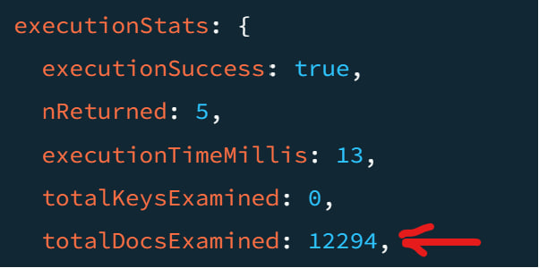

Зафиксировали, что количество документов, проверенных за время выполнение запроса равно 12294, это параметр totalDocsExamined. Время для планирования и выполнения запроса записана в параметре executionTimeMillis, в нашем случае это 13 милисекунд.

Кажется, стоит сделать индекс именно по количеству просмотров, ибо релевантно смотреть на более менее популярные сериалы
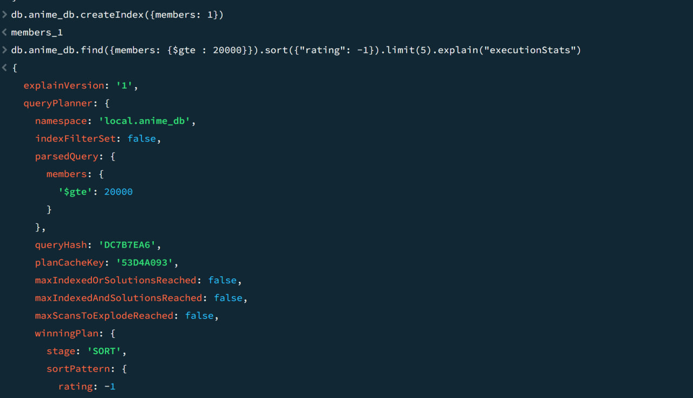

Посмотрим теперь на количество исследованных документов
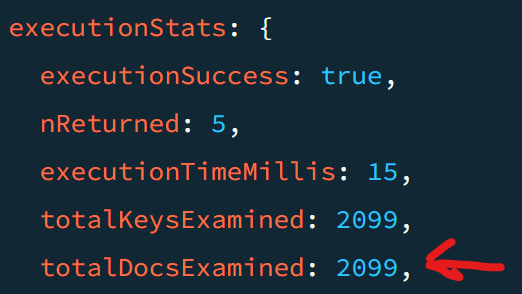

Видим, что количество милисекунд у нас увеличилось на 2, а вот totalDocsExamined уменьшился в раз 6 примерно. Это наводит нас на мысль, что у нас не так много данных в БД, так что время работы у нас даже увеличилось, однако на более больших БД у нас время уменьшится, ведь количество проверенных за время выполнение запроса у нас уменьшилось в 6 раз. 

